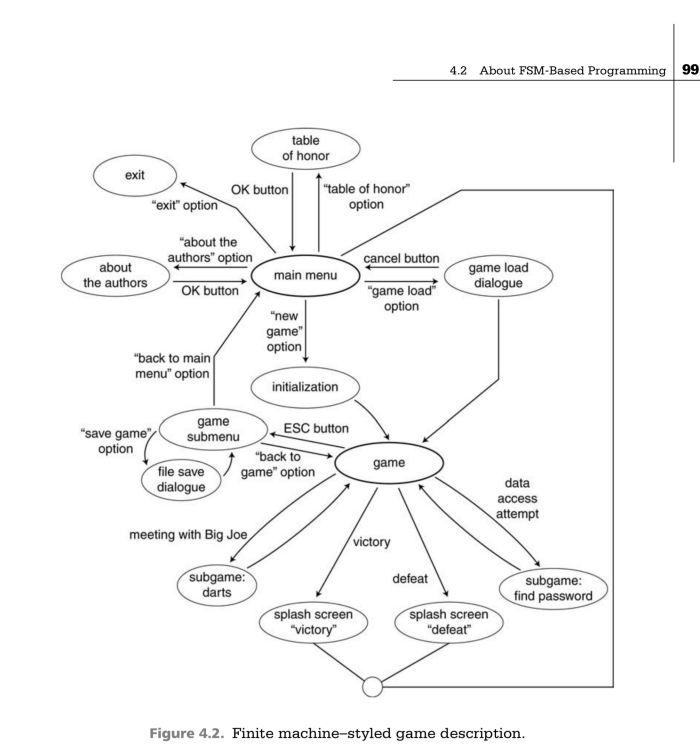

# proyectos_lenguajes_automatas
Proyecto de unidad 2 actividad 12

#Descripción
Problema: 12 JOSE CARLOS MAR RANGEL

12.- Implementar el FSM que se describe en la Figura 4.2 del Libro.  Se debe crear una INTERFAZ grafica PyQT para interactuar con el sistema que controla el FSM.

